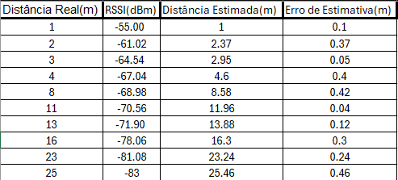
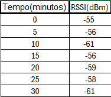

# softween-projeto

## Código-Fonte

O código-fonte está disponível na pasta [`/scr`](src).

## Arquitetura do Sistema

# Introdução:

# Problema:
A necessidade de rastrear a localização precisa de objetos dentro de um ambiente industrial. No caso deste projeto, utilizamos uma solução para localizar um carrinho plataforma da John Deere, oferecendo dados em tempo real que podem otimizar a logística interna.

# Objetivos:
Criar uma solução baseada em IoT que, utilizando o ESP32, permitindo localizar o carrinho em tempo real.

# Desenvolvimento:

**Arquitetura da Solução:**

Abrir com draw.io para melhor visualização:
https://drive.google.com/file/d/1niPyul0DXf_Rf4q41qjiJOG7rxCTIb87/view?usp=drive_link

**Componentes:**
 
ESP32 - Responsável por capturar o RSSI e outros dados de localização.
 
Website - Onde os dados são processados e armazenados.
 
Mapa Web - Exibe a posição em tempo real no mapa, usando tecnologias como Leaflet.js.
 

**Tecnologias Utilizadas:**
 
ESP32: Para captura e envio de dados de RSSI.
 
WiFi: Redes locais para comunicação.
 
Leaflet.js: Biblioteca de mapas para exibir a localização.
 
GitHub: Repositório de código e documentação.

# Resultados:

**Exemplo de Dados:**
 
**FIAP - PRÉDIO 1**
 
Latitude: -23.574500474355066.
 
Longitude: -46.62328305935707.
 
**SALGADELICIA**
 
Latitude: -23.57452198495069.
 
Longitude: -46.62302623787215.
 
 
**Distância calculada: 25 metros.**
 
**Direção: Norte e Oeste (Noroeste).**

## Testes de Desempenho

### Teste de Precisão de Localização

#### Definição da Ferramenta de Teste:
Este teste consegue avaliar a precisão do cálculo de localização baseado no valor de RSSI (-55 dBm a 1 metro) em distâncias reais de 1 a 25 metros. Utilizamos um ESP32 para coletar os valores de RSSI e calcular a distância estimada com base nesses dados.

#### Tabela de Testes:
A tabela apresenta as distâncias reais em metros, os valores de RSSI medidos e as distâncias estimadas. O erro de estimativa é calculado como a diferença entre a distância real e a estimada.

####  Discussão dos Resultados:
Os resultados mostram que a precisão do cálculo de distância utilizando o RSSI é bastante aceitável para a maioria das distâncias. O erro de estimativa permanece pequeno, variando de 0,04m a 0,46m, o que é adequado para o cenário proposto.

---

###  Teste de Estabilidade de Sinal

####  Definição da Ferramenta de Teste:
Este teste verifica a variação da intensidade do sinal (RSSI) ao longo do tempo para verificar a estabilidade do sinal de Wifi em diferentes momentos.

####  Evidências de Testes:
A tabela mostra os valores do RSSI coletados em intervalos de tempo de 5 minutos durante 30 minutos.

####  Soluções Futuras:
Para melhorar a precisão, uma técnica que poderia ser implementada é o uso de múltiplos pontos de acesso ou ser aplicado uma rede de Wifi Mesh para triangulação, para melhorarmos nos dados de distância com base no RSSI.
