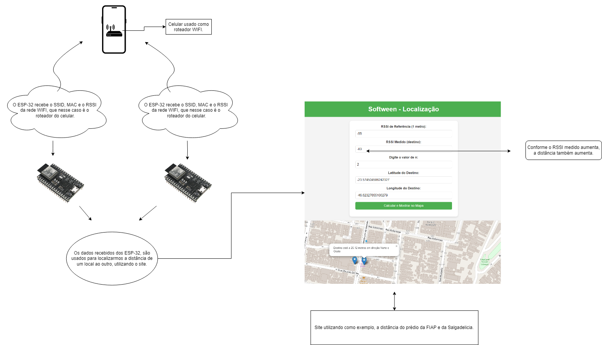

# softween-projeto

## Código-Fonte

O código-fonte está disponível na pasta [`/scr`](src).

## Arquitetura do Sistema

# Introdução:

# Problema:
A necessidade de rastrear a localização precisa de objetos dentro de um ambiente industrial. No caso deste projeto, utilizamos uma solução para localizar um carrinho plataforma da John Deere, oferecendo dados em tempo real que podem otimizar a logística interna.

# Objetivos:
Criar uma solução baseada em IoT que, utilizando o ESP32, permitindo localizar o carrinho em tempo real.

# Desenvolvimento:

**Arquitetura da Solução:**

Abrir com draw.io para melhor visualização:
https://drive.google.com/file/d/1niPyul0DXf_Rf4q41qjiJOG7rxCTIb87/view?usp=drive_link

**Componentes:**
 
ESP32 - Responsável por capturar o RSSI e outros dados de localização.
 
Website - Onde os dados são processados e armazenados.
 
Mapa Web - Exibe a posição em tempo real no mapa, usando tecnologias como Leaflet.js.
 

**Tecnologias Utilizadas:**
 
ESP32: Para captura e envio de dados de RSSI.
 
WiFi: Redes locais para comunicação.
 
Leaflet.js: Biblioteca de mapas para exibir a localização.
 
GitHub: Repositório de código e documentação.

# Resultados:

Exemplo de Dados:
**FIAP - PRÉDIO 1**
Latitude: -23.574500474355066.
 
Longitude: -46.62328305935707.
 
 
**SALGADELICIA**
Latitude: -23.57452198495069.
 
Longitude: -46.62302623787215.
 
Distância calculada: 25 metros.
 
Direção: Norte e Oeste (Noroeste).

